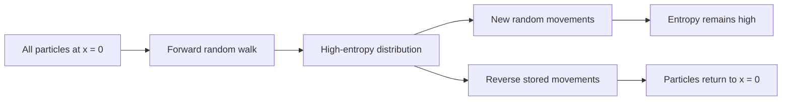
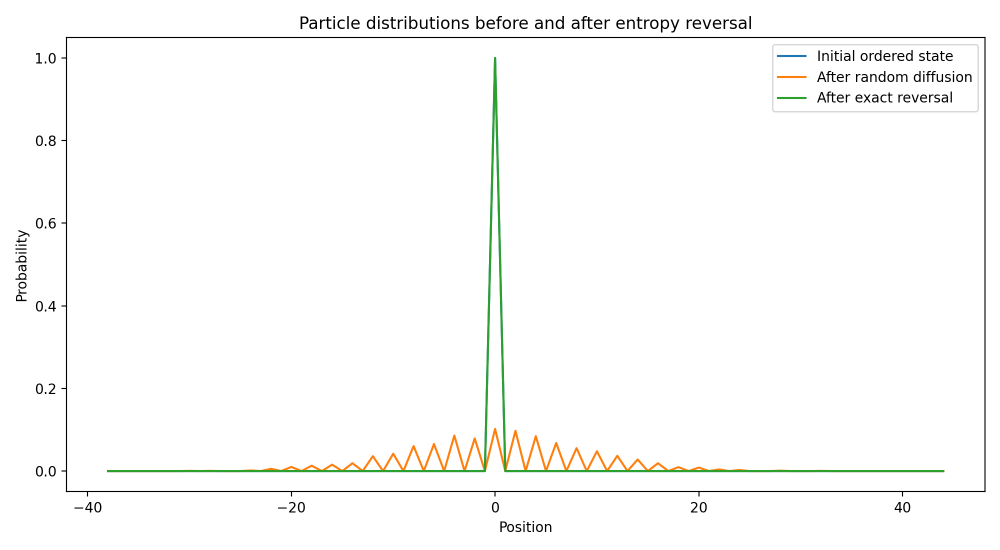
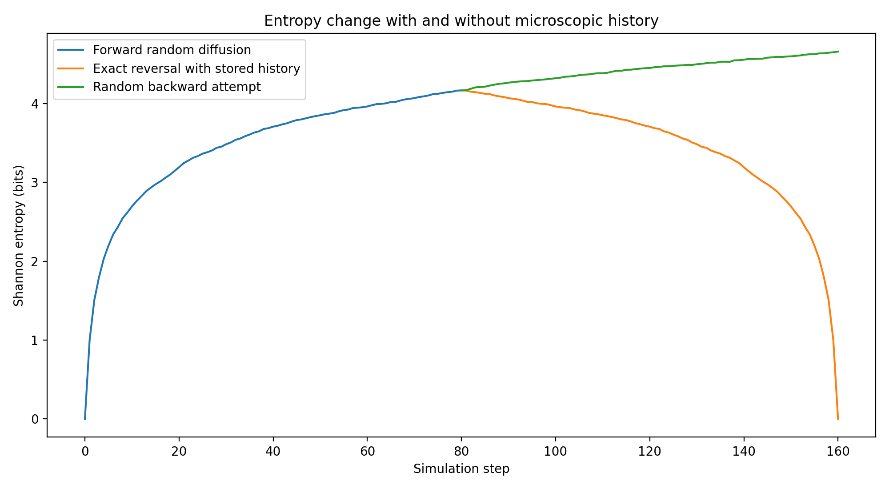
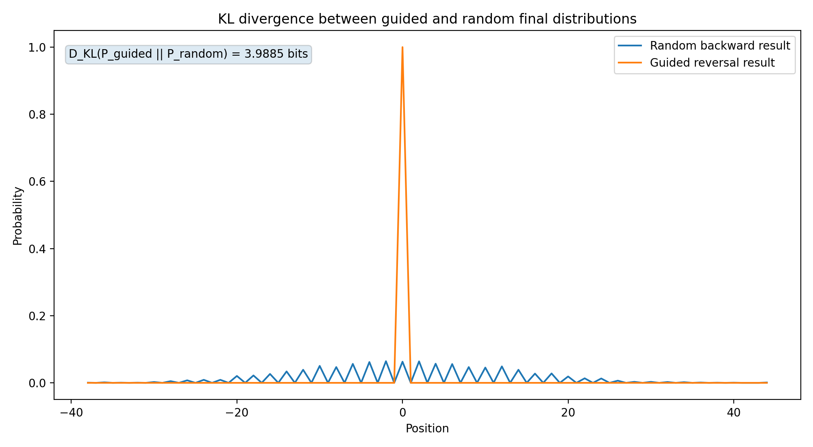
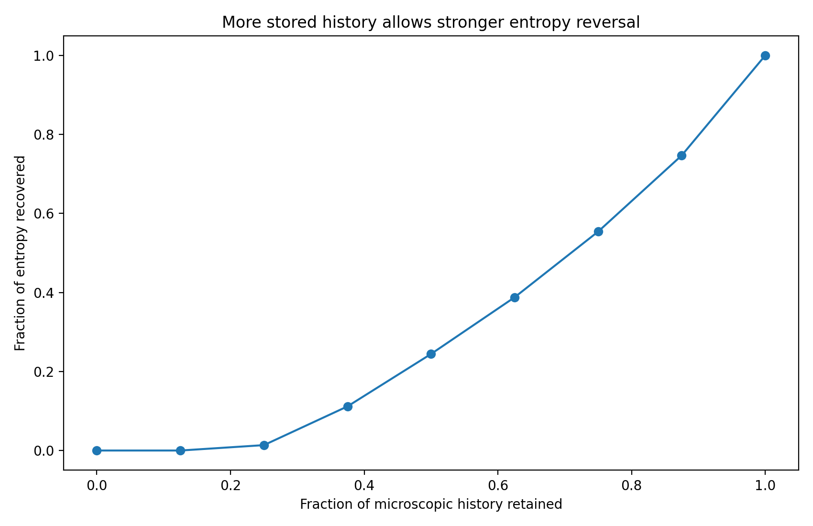

# Information as Memory for Controlled Entropy Reversal

**Name:** CHEN JUNQI
Student ID:5807045Z

## 1. Overview

This project explores my own idea of what information is.

My idea was partly inspired by Christopher Nolan's movie *Tenet*. In the movie, some objects appear to move in the opposite direction of entropy. I do not treat this as a real physical phenomenon. Instead, I use it as a starting point for a computational question:

> What does a system need in order to return from a disordered state to a previous ordered state?

My answer is that the system needs information about its microscopic history. Therefore, in this project, I regard information as a stored record that constrains future operations and makes controlled entropy reduction possible.

I test this idea with a one-dimensional random-walk model. Many particles begin at the same position and then move randomly. Their position distribution spreads and its Shannon entropy increases. If the particles simply continue to move randomly, the original state is not recovered. However, if every microscopic movement is stored and later applied in reverse order, the particles return to the initial state.

## 2. Goal and Research Question

The main goal is to compare the following three processes:

1. **Forward diffusion:** particles move randomly and become distributed over many positions.
2. **Random backward attempt:** particles take new random steps without using any stored history.
3. **Guided reversal:** the exact movement history is stored and applied in reverse order.

The main research question is:

> How much does stored microscopic history help a system recover a low-entropy state?

I also test partial memory. Only a fraction of the movement history is retained, while the missing part is replaced by random movements.

## 3. My Idea of Information

Shannon information is often introduced as a reduction of uncertainty. In this project, I use a related but more operational idea:

> Information is a record or constraint that allows a system to select a specific future operation from many possible operations.

The final macroscopic particle distribution does not contain enough information to reconstruct the exact path of every particle. Many different microscopic histories can produce similar final distributions.

By contrast, the complete movement history specifies exactly how to undo every microscopic change. This stored history is actionable because it can be used to produce a different future: a return toward the previous ordered state.

Therefore, I define information here as:

> **Memory that makes controlled entropy reduction possible.**

This is a project-specific interpretation, not a new universal definition of information.

## 4. Mathematical Model

### 4.1 Random walk

There are \(N\) particles on a one-dimensional integer line. Initially, all particles are placed at the origin:

$$
x_i(0)=0,
\qquad i=1,\ldots,N.
$$

At every time step, each particle independently moves one step to the left or right:

$$
x_i(t+1)=x_i(t)+r_i(t),
$$

where

$$
r_i(t)\in\{-1,+1\}.
$$

In the experiment:

- \(N=2000\) particles
- \(T=80\) forward steps
- random seed \(=42\)

The fixed seed makes the result reproducible.

### 4.2 Shannon entropy of the particle distribution

Let \(p_x(t)\) be the fraction of particles located at position \(x\) at time \(t\). I calculate the Shannon entropy of this distribution as

$$
S(t)=-\sum_x p_x(t)\log_2 p_x(t).
$$

At the initial time, all particles are at the same position, so the entropy is approximately zero. During random diffusion, the particles spread across more positions and the entropy increases.

### 4.3 Exact reversal

During the forward random walk, every value of \(r_i(t)\) is stored.

To reverse the process, the stored steps are read in reverse time order and their signs are changed:

$$
x_i(t)=x_i(t+1)-r_i(t).
$$

For example, if a particle previously moved \(+1\), the inverse operation is \(-1\).

### 4.4 Partial memory

Let \(f\in[0,1]\) be the fraction of microscopic movements that are remembered.

- With probability \(f\), the correct inverse movement is used.
- With probability \(1-f\), a new random movement is used.

I define the entropy recovery ratio as

$$
R=
\frac{S_{\mathrm{forward}}-S_{\mathrm{final}}}
     {S_{\mathrm{forward}}-S_{\mathrm{initial}}}.
$$

Interpretation:

- \(R=0\): no entropy increase is recovered
- \(R=1\): all entropy increase is recovered

### 4.5 Proposed entropy-reversal information

To compare a random backward attempt with a guided reversal, I propose the following illustrative quantity:

$$
I_{\mathrm{reverse}}(t)
=
S_{\mathrm{random}}(t)-S_{\mathrm{guided}}(t).
$$

A large value means that the stored history strongly changes the system's ability to return toward an ordered state.

This quantity is used only as an experimental measure in this project.

### 4.6 KL divergence and its connection to the course

The current code directly uses **Shannon entropy**, which was introduced in the lecture as

$$
H(P)=-\sum_x p(x)\log_2 p(x).
$$

In this project, Shannon entropy measures the uncertainty of the particle-position distribution. It is therefore the main quantity used to show the change from an ordered state to a more widely distributed state.

I also add **KL divergence**, which was used in the IIT lecture to compare a constrained distribution with an unconstrained distribution:

$$
D_{\mathrm{KL}}(P\parallel Q)
=
\sum_x P(x)\log_2\frac{P(x)}{Q(x)}.
$$

For this project, I define

- $P_{\mathrm{guided}}$: the final distribution after exact reversal using the stored history;
- $P_{\mathrm{random}}$: the final distribution after a random backward attempt without the stored history.

Then I calculate

$$
I_{\mathrm{history}}
=
D_{\mathrm{KL}}
\left(
P_{\mathrm{guided}}
\parallel
P_{\mathrm{random}}
\right).
$$

This quantity shows how strongly the distribution produced by stored history differs from the no-history baseline. In the language of the IIT lecture, the stored history acts as a constraint that changes the distribution of possible future states.

KL divergence is not symmetric, so the order of the two distributions matters. Here, the direction $D_{\mathrm{KL}}(P_{\mathrm{guided}}\parallel P_{\mathrm{random}})$ is chosen because the guided result is treated as the constrained outcome and the random result as the unconstrained reference.

## 5. Experimental Flow



The program performs the following steps:

1. Place all particles at the origin.
2. Run 80 random-walk steps.
3. Store every movement of every particle.
4. Calculate entropy at each time step.
5. Start from the final state and try a new random process.
6. Start again from the final state and apply the exact inverse history.
7. Repeat the reversal experiment with different retained-memory fractions.
8. Save the results as figures.

## 6. Virtual Environment and Requirements

This project uses a Conda virtual environment.

The environment is defined in `environment.yml` and contains:

- Python 3.12
- NumPy
- Matplotlib

## 7. How to Run the Code

### Step 1: Download or clone the repository

```bash
git clone https://github.com/junqichen1999/entropy-reversal-information.git
cd entropy-reversal-information
```

### Step 2: Create the Conda environment

```bash
conda env create -f environment.yml
```

### Step 3: Activate the environment

```bash
conda activate entropy-information
```

### Step 4: Run the simulation

```bash
python entropy_reversal.py
```

The program prints numerical results in the terminal and creates four image files in the `figures` folder.

### Expected terminal output

The exact displayed negative zero may appear because of floating-point calculation, but it means zero.

```text
Simulation finished.
Initial entropy: 0.0000 bits
Entropy after diffusion: 4.1673 bits
Entropy after exact reversal: 0.0000 bits
Entropy after random backward attempt: 4.6601 bits
Exact return rate: 1.0000
Random return rate: 0.0630
KL divergence D_KL(P_guided || P_random): 3.9885 bits
```

## 8. Results

### 8.1 Particle distributions



At the beginning, all particles are located at the center. Therefore, the distribution is highly ordered and its entropy is approximately zero.

After the random walk, the particles are distributed over many positions. The distribution becomes wider and less predictable.

After exact reversal, all particles return to the origin. The final distribution overlaps with the initial distribution. This result confirms that the stored microscopic history is sufficient to reproduce the previous state in this model.

### 8.2 Entropy over time



During forward diffusion, Shannon entropy increases from approximately \(0\) bits to \(4.1673\) bits.

The random backward attempt does not reproduce the past. Its entropy remains high and reaches approximately \(4.6601\) bits.

In contrast, exact reversal uses the stored history and reduces the entropy back to approximately \(0\) bits. The important difference is not the word "backward," but whether the correct microscopic information is available.

At the end of the experiment,

$$
I_{\mathrm{reverse}}
\approx
4.6601-0
=
4.6601\ \text{bits}.
$$

This value represents the difference between the random and guided processes in this particular simulation.

### 8.3 KL divergence between guided and random results



The updated code calculates

$$
D_{\mathrm{KL}}
\left(
P_{\mathrm{guided}}
\parallel
P_{\mathrm{random}}
\right)
\approx 3.9885\ \text{bits}.
$$

The guided distribution is concentrated at the initial position because the complete movement history is used. The random backward distribution is spread across many positions, and only about $6.3\%$ of particles happen to return to the origin.

The positive KL divergence shows that the guided result is clearly distinguishable from the no-history baseline. This gives a second mathematical view of the role of information:

- Shannon entropy measures the uncertainty inside each distribution;
- KL divergence compares two different distributions.

The use of KL divergence also makes the connection to the IIT lecture more direct. In IIT, information is expressed as the difference between a constrained distribution and an unconstrained distribution. In this project, the stored microscopic history provides the constraint.

### 8.4 Memory fraction and entropy recovery



The partial-memory experiment produced the following results:

| Retained history fraction | Entropy recovery ratio | Particle return rate |
|---:|---:|---:|
| 0.000 | 0.000 | 0.063 |
| 0.125 | 0.000 | 0.177 |
| 0.250 | 0.014 | 0.302 |
| 0.375 | 0.112 | 0.410 |
| 0.500 | 0.244 | 0.532 |
| 0.625 | 0.388 | 0.649 |
| 0.750 | 0.554 | 0.766 |
| 0.875 | 0.747 | 0.882 |
| 1.000 | 1.000 | 1.000 |

When no movement history is retained, only about \(6.3\%\) of the particles happen to return to the origin, and no meaningful entropy recovery is observed.

As the retained-history fraction increases, both the entropy recovery ratio and the particle return rate increase.

The relationship is not perfectly linear. Small amounts of memory are not sufficient for strong recovery, because many incorrect steps still accumulate. Complete recovery occurs only when the complete microscopic history is available.

## 9. Discussion and Analysis

### 9.1 Why the final distribution is not enough

The final distribution is a macroscopic description. It shows how many particles are located at each position, but it does not show the individual path of every particle.

For example, two particles may arrive at the same final position after completely different sequences of left and right movements. Therefore, many microscopic histories are compatible with the same or similar macroscopic distribution.

This means that the final distribution has lost information about the exact trajectory.

### 9.2 Information as a constraint on the future

Without the stored history, every particle has two possible movements at each step. The number of possible reverse-operation sequences is extremely large.

The stored history removes this uncertainty. It selects one specific inverse operation for every particle and every time step.

In this sense, information acts as a constraint on possible future operations. It does not physically move the particles by itself, but it tells the controller which movement should be applied.

### 9.3 Relation to Shannon entropy

Shannon entropy measures uncertainty in the particle-position distribution.

In the forward random walk, more positions become possible, so the entropy increases. During exact reversal, the distribution becomes concentrated again, so the entropy decreases.

However, the stored movement history contains much more detail than the position-distribution entropy alone. This difference is important: a small macroscopic entropy does not describe the full microscopic record needed to reconstruct a trajectory.

### 9.4 Relation to Integrated Information Theory

In the IIT lecture, a current state is informative when it constrains possible past or future states. The lecture used KL divergence to measure the difference between constrained and unconstrained possibilities.

This project uses a similar idea. The stored microscopic history strongly constrains the next operation during reversal. Without this information, the system has many possible future paths. With it, one specific return path is selected.

The KL-divergence calculation makes this relation explicit:

$$
I_{\mathrm{history}}
=
D_{\mathrm{KL}}
\left(
P_{\mathrm{guided}}
\parallel
P_{\mathrm{random}}
\right).
$$

The project is not a calculation of integrated information $\Phi$, because it does not partition the system and compare whole-system and part-system repertoires. However, it shares the more basic IIT idea that information can be understood as a constraint that changes a distribution of possible states.

### 9.5 Relation to dynamical systems

A dynamical system may have many possible trajectories. Knowing only a final point or final distribution does not always determine which trajectory occurred.

The movement history distinguishes one actual trajectory from many alternatives. In this project, information about the trajectory is necessary to reconstruct it.

### 9.6 Relation to cryptography

The cryptography lecture distinguished what can be learned from available observations.

An observer who sees only the final particle distribution cannot determine the exact microscopic history. An observer who also possesses the stored movement record can reconstruct the past state.

This is similar to the idea that the value of information depends on what data or key an observer possesses and what distinctions the observer can make.

### 9.7 Why this does not violate the second law of thermodynamics

This simulation does not show spontaneous entropy decrease in an isolated physical system.

The reversal requires:

- a computer,
- stored memory,
- a control procedure,
- and energy to operate them.

These external resources are not included in the Shannon entropy of the particle-position distribution.

In a real physical system, storing, reading, and erasing memory also have thermodynamic costs. Therefore, the local entropy of the simulated particle distribution can decrease while the total entropy of the larger physical system does not violate the second law of thermodynamics.

The movie *Tenet* is only an inspiration for the question. The simulation does not claim that real objects can reverse their thermodynamic arrow of time.

## 10. Main Conclusion

The experiment supports the following interpretation:

> Information is not only a numerical reduction of uncertainty. It can also be a stored record that constrains future operations and makes the recovery of a previous low-entropy state possible.

Random motion alone does not reconstruct the past. Exact reconstruction requires detailed microscopic information.

The partial-memory result also shows that information has a quantitative effect. More retained history produces stronger entropy recovery, while complete recovery requires complete history in this model.

## 11. Limitations and Future Work

This project is a simplified model.

- The particles do not interact.
- The random walk is one-dimensional.
- The system stores every movement without error.
- The memory and energy costs are not modeled.
- Shannon entropy of particle positions is not identical to thermodynamic entropy.
- The proposed \(I_{\mathrm{reverse}}\) is an illustrative project measure, not a standard information-theory quantity.

Possible future extensions include:

1. adding interactions or collisions between particles;
2. adding errors to the stored history;
3. measuring the number of bits needed to store the history;
4. modeling the energy cost of memory;
5. comparing data compression with entropy recovery;
6. extending the model to two dimensions.

## 12. Repository Structure

```text
entropy-reversal-information/
├── README.md
├── entropy_reversal.py
├── environment.yml
├── .gitignore
└── figures/
    ├── particle_distributions.png
    ├── entropy_over_time.png
    ├── kl_divergence_comparison.png
    └── memory_vs_recovery.png
```
